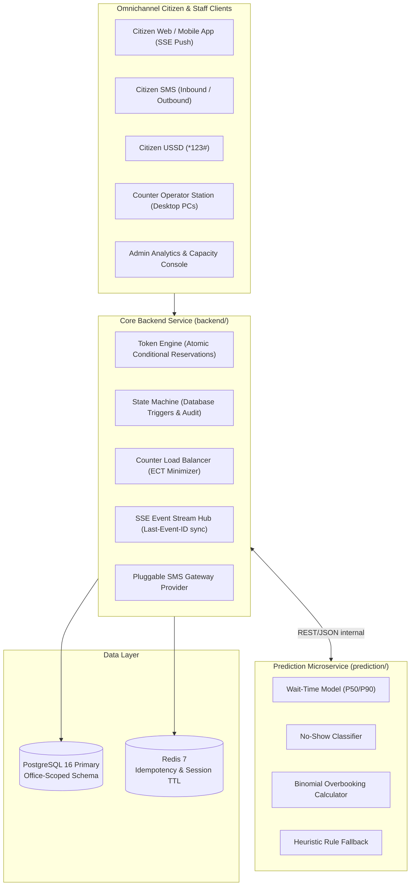

# Smart Queue Token System

> **Modern, AI-Calibrated Virtual Queue & Token Platform for Government Offices and Hospital Outpatient Departments (OPDs).**

[](https://openjdk.org/)
[](https://spring.io/projects/spring-boot)
[](https://fastapi.tiangolo.com/)
[](https://react.dev/)
[](https://www.docker.com/)

---

> 📖 **Complete Documentation**: For an in-depth operational manual, multi-office architecture breakdown, and full feature guide, consult [`SYSTEM_GUIDE.md`](file:///d:/Smart%20Queue/SYSTEM_GUIDE.md).

## 📋 Executive Overview

Physical queuing in government offices (e.g., Divisional Secretariat offices, Grama Niladhari counters) and hospital OPD clinics causes severe congestion, unpredictable waiting times, and low counter utilization. 

The **Smart Queue Token System** solves this by:
1. Enabling citizens to request virtual tokens remotely via **Web App**, **USSD**, or **SMS**.
2. Providing **calibrated real-time wait-time estimates** using load balancing and machine learning.
3. Implementing **probabilistic overbooking** based on predicted no-show rates to safely maximize counter throughput without physical overcrowding.
4. Equipping counter operators with a **high-efficiency desktop workstation interface** featuring rapid keyboard shortcuts.

---

## 🏛️ System Architecture



---

## 📂 Repository Layout

| Directory | Technology | Description |
|---|---|---|
| [`backend/`](file:///d:/Smart%20Queue/backend) | **Java 21, Spring Boot 3.4.3, Flyway, JPA** | Core queue engine, atomic slot reservations, state machine enforcement, load balancing, SSE stream hub. |
| [`prediction/`](file:///d:/Smart%20Queue/prediction) | **Python 3.11+, FastAPI, Pydantic, Scikit-learn** | Stateless intelligence service for wait times, no-show probabilities, and exact binomial overbooking bounds. |
| [`web/`](file:///d:/Smart%20Queue/web) | **React 19, Vite, Vanilla CSS** | Web portal containing Citizen Queue Tracker, Desktop Operator Station, Admin Console, and SMS Sandbox. |
| [`docker-compose.yml`](file:///d:/Smart%20Queue/docker-compose.yml) | **Docker Compose** | Production orchestration for PostgreSQL 16, Redis 7, Backend, and Prediction microservices. |

---

## 🌟 Key Technical Innovations

- **Zero-Overselling Concurrency Defense**: Uses atomic conditional updates (`WHERE issued_count < max_limit`) to ensure zero slot overselling even under 1,000+ simultaneous requests.
- **Dual NIC Format Support**: Validates and normalizes both legacy 9-digit with suffix (`145896235V`) and modern 12-digit (`144756235896`) formats via `^([0-9]{9}[vVxX]|[0-9]{12})$`.
- **Desktop Ergonomics for Operators**: Counter station optimized for desktop PC monitors with keyboard hotkeys (<kbd>Space</kbd> Call Next, <kbd>S</kbd> Serve, <kbd>C</kbd> Complete, <kbd>K</kbd> Skip, <kbd>R</kbd> Recall, <kbd>X</kbd> No-Show) and Web Audio chimes.
- **Full Token Lifecycle & Cancellation**: Formally handles `WAITING ➔ CANCELLED` and `CALLED ➔ CANCELLED`, immediately reclaiming slot capacity upon withdrawal.
- **Probabilistic Overbooking Math**: Exact cumulative binomial tail probability model $\sum_{k=C+1}^{N} \binom{N}{k} p^k (1-p)^{N-k} \le \alpha$ ensures the risk of overcrowding stays under the configured policy (default 10%).
- **Pluggable Zero-Cost SMS Sandbox**: Built-in test sandbox allows evaluating SMS commands (`STATUS <token>`, `CANCEL <token>`, `HELP`) and reviewing outbound logs with $0 telco cost.

---

## 🚀 Quick Start Guide

### Option A: Run with Docker Compose
```bash
# Start all services (Postgres 16, Redis 7, Backend, Prediction service)
docker compose up --build
```
- **Backend API**: `http://localhost:8080`
- **Prediction Microservice**: `http://localhost:8000` (Swagger docs at `/docs`)

---

### Option B: Run Standalone for Development

#### 1. Backend Service (`backend/`)
```bash
cd backend
./mvnw.cmd spring-boot:run
```
*Backend runs on `http://localhost:8080`. Automatically seeds the Colombo Divisional Secretariat Pilot Office on initial boot.*

#### 2. Prediction Microservice (`prediction/`)
```bash
cd prediction
.\venv\Scripts\uvicorn main:app --port 8000 --reload
```
*Microservice runs on `http://localhost:8000`.*

#### 3. Web Application (`web/`)
```bash
cd web
npm install
npm run dev
```
*Web dashboard opens on `http://localhost:5173` with proxy routing to `/api`.*

---

## 🧪 Automated Test Verification

| Component | Test Suite | Tests Run | Result |
|---|---|---|---|
| **Spring Boot Backend** | `mvnw test` (Concurrency, Lifecycle, Dual NIC, Idempotency) | 7 | **7 Passed (100%)** |
| **Prediction Microservice** | `pytest tests/test_services.py` (Binomial tail math, Peak hours) | 3 | **3 Passed (100%)** |
| **Frontend Web App** | `npm run build` (Vite production bundle compilation) | 16 modules | **Passed (0 errors)** |

---

## 📈 Phased Rollout & Scale Roadmap

- **Pilot Stage (Current)**:
  - Deployed at a single office / OPD (Colombo Pilot Office).
  - Statistically conservative default rules with cold-start heuristics.
  - **Day-One Seeds**: `office_id` present on all schema tables; stateless queue service; REST boundaries strictly maintained.
- **Scale Stage**:
  - Add subsequent offices simply by inserting new `offices` records (zero schema migrations required).
  - Adopt Kubernetes, Kafka/RabbitMQ, and Airflow only once multi-office telemetry and measured load justifies them.
