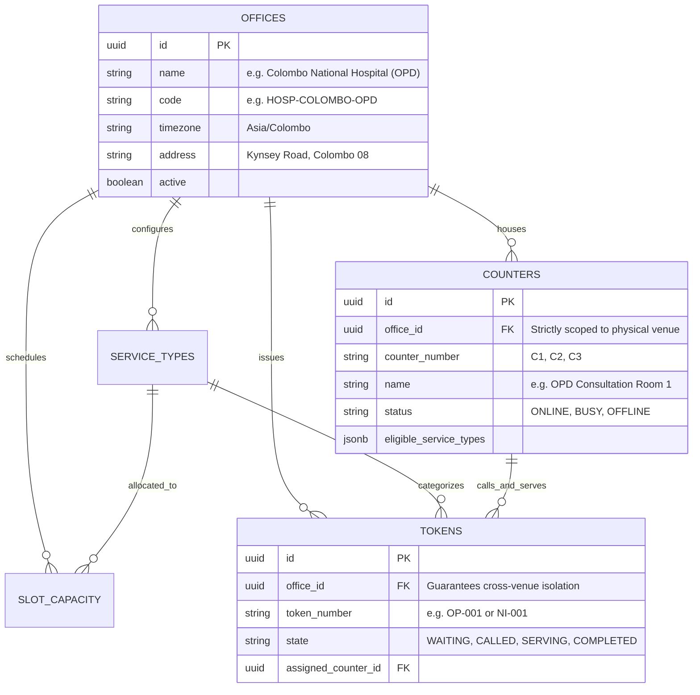
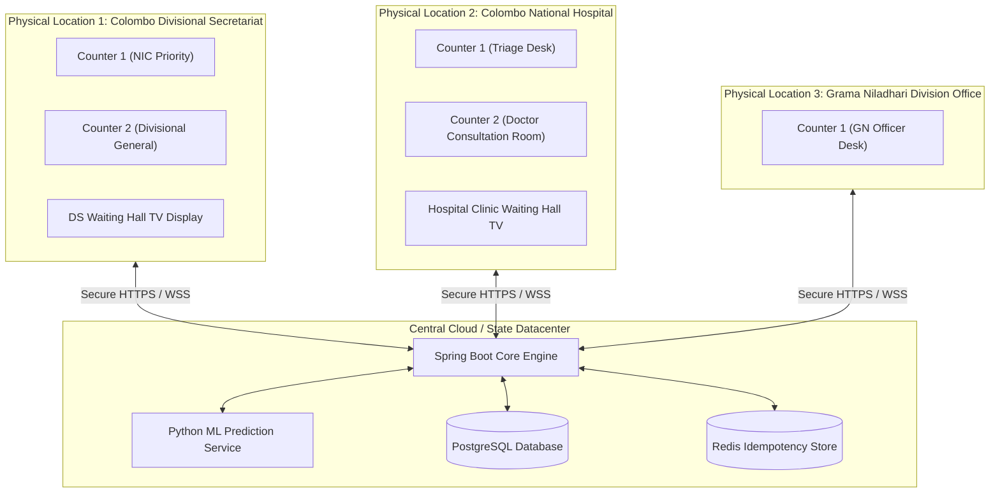
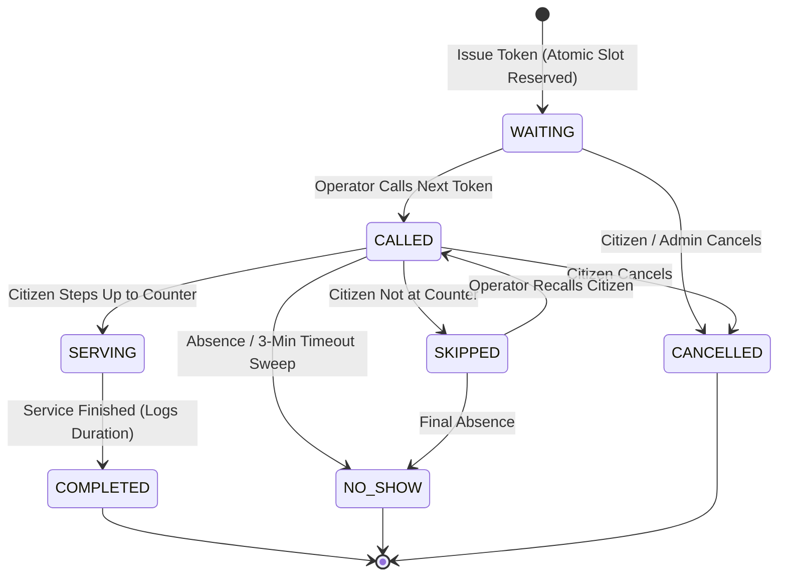

# Smart Queue Token System — Complete System Guide & Knowledge Base

> **Comprehensive reference manual covering all architectural decisions, platform features, mathematical models, operational workflows, and the multi-office physical location model.**

---

## 📑 Table of Contents

1. [Executive System Overview](#1-executive-system-overview)
2. [The "Office Thing": Multi-Location & Physical Venue Isolation](#2-the-office-thing-multi-location--physical-venue-isolation)
   - [2.1 The Physical Reality Check](#21-the-physical-reality-check)
   - [2.2 Why the Pilot Seed Bundled Them (Development Mock)](#22-why-the-pilot-seed-bundled-them-development-mock)
   - [2.3 Multi-Tenant Database Architecture (`office_id`)](#23-multi-tenant-database-architecture-office_id)
   - [2.4 Real-World Deployment Topology](#24-real-world-deployment-topology)
   - [2.5 How to Add & Separate Physical Offices](#25-how-to-add--separate-physical-offices)
3. [Omnichannel Citizen Booking & Tracking](#3-omnichannel-citizen-booking--tracking)
   - [3.1 Web Portal & Real-Time Queue Tracker](#31-web-portal--real-time-queue-tracker)
   - [3.2 Dual NIC Format Validation & Normalization](#32-dual-nic-format-validation--normalization)
   - [3.3 Citizen Privacy Protection (Hashing & Masking)](#33-citizen-privacy-protection-hashing--masking)
   - [3.4 Self-Service Cancellation & Slot Reclamation](#34-self-service-cancellation--slot-reclamation)
   - [3.5 Telco SMS Channel & Grammar](#35-telco-sms-channel--grammar)
   - [3.6 USSD Channel Integration (`*123#`)](#36-ussd-channel-integration-123)
4. [Desktop Counter Operator Workstation](#4-desktop-counter-operator-workstation)
   - [4.1 Workstation Ergonomics for Low-Spec & High-Res PC Monitors](#41-workstation-ergonomics-for-low-spec--high-res-pc-monitors)
   - [4.2 Rapid Non-Mouse Keyboard Hotkeys](#42-rapid-non-mouse-keyboard-hotkeys)
   - [4.3 Synthesized Web Audio Chimes](#43-synthesized-web-audio-chimes)
   - [4.4 Active Service Stopwatch & Duration Telemetry](#44-active-service-stopwatch--duration-telemetry)
   - [4.5 Operational Protocol: Skip vs. No-Show](#45-operational-protocol-skip-vs-no-show)
5. [Waiting Hall Big-Screen TV Display (Public Kiosk)](#5-waiting-hall-big-screen-tv-display-public-kiosk)
   - [5.1 Multi-Counter Display Matrix](#51-multi-counter-display-matrix)
   - [5.2 Live Flashing Turn Alerts](#52-live-flashing-turn-alerts)
   - [5.3 Physical Office Isolation on Public Screens](#53-physical-office-isolation-on-public-screens)
6. [Intelligent Routing & Load Balancing](#6-intelligent-routing--load-balancing)
   - [6.1 Estimated Completion Time (ECT) Minimization](#61-estimated-completion-time-ect-minimization)
   - [6.2 Counter Service-Type Eligibility Matrix](#62-counter-service-type-eligibility-matrix)
   - [6.3 Priority Tokens & Fast-Track Routing](#63-priority-tokens--fast-track-routing)
7. [AI & Prediction Microservice](#7-ai--prediction-microservice)
   - [7.1 Probabilistic Overbooking Math (Binomial Tail Model)](#71-probabilistic-overbooking-math-binomial-tail-model)
   - [7.2 Calibrated Wait-Time Forecasting (P50 & P90 Confidence Bounds)](#72-calibrated-wait-time-forecasting-p50--p90-confidence-bounds)
   - [7.3 No-Show Probability & Lead-Time Decay](#73-no-show-probability--lead-time-decay)
   - [7.4 Peak-Hour Surge Heuristics](#74-peak-hour-surge-heuristics)
   - [7.5 Resilient Fallback & Graceful Degradation](#75-resilient-fallback--graceful-degradation)
8. [Concurrency, Data Integrity & State Machine](#8-concurrency-data-integrity--state-machine)
   - [8.1 Zero-Overselling Concurrency Defense (Atomic DB Locks)](#81-zero-overselling-concurrency-defense-atomic-db-locks)
   - [8.2 Strict Finite State Machine (FSM)](#82-strict-finite-state-machine-fsm)
   - [8.3 Automated 3-Minute Timeout Sweeper](#83-automated-3-minute-timeout-sweeper)
   - [8.4 Idempotency Protection Against Duplicate Bookings](#84-idempotency-protection-against-duplicate-bookings)
   - [8.5 Comprehensive Audit Logging](#85-comprehensive-audit-logging)
9. [Administrative Console & Capacity Control](#9-administrative-console--capacity-control)
   - [9.1 Session Windows & Daily Quotas](#91-session-windows--daily-quotas)
   - [9.2 Administrator Overbooking Ceiling Overrides](#92-administrator-overbooking-ceiling-overrides)
   - [9.3 Real-Time Counter Fleet Monitoring](#93-real-time-counter-fleet-monitoring)
10. [Telco SMS Sandbox & Integration](#10-telco-sms-sandbox--integration)
    - [10.1 Pluggable SMS Gateway Provider Pattern](#101-pluggable-sms-gateway-provider-pattern)
    - [10.2 Zero-Cost In-Browser Testing Sandbox](#102-zero-cost-in-browser-testing-sandbox)
11. [Deployment, Setup & Tech Stack](#11-deployment-setup--tech-stack)
    - [11.1 Technology Stack Summary](#111-technology-stack-summary)
    - [11.2 Docker Compose Quickstart](#112-docker-compose-quickstart)
    - [11.3 Local Standalone Development Setup](#113-local-standalone-development-setup)
12. [Operational Rules of Thumb & "Gotchas"](#12-operational-rules-of-thumb--gotchas)

---

## 1. Executive System Overview

The **Smart Queue Token System** is an enterprise queue management and capacity optimization platform designed for public sector agencies (e.g., Divisional Secretariats, Grama Niladhari offices) and healthcare institutions (e.g., Hospital Outpatient Departments / OPDs).

### Key Problems Solved:
1. **Uncontrolled Physical Overcrowding**: Citizens no longer crowd hallways and counters; they can wait safely off-site or in designated waiting areas until summoned.
2. **Unpredictable Wait Times**: Machine learning models calculate dynamic, calibrated estimated arrival times (P50 and P90 confidence bounds).
3. **Counter Underutilization Due to No-Shows**: High citizen abandonment is mitigated by exact **probabilistic overbooking**, ensuring counters remain fully utilized without exceeding safe crowding thresholds.
4. **Digital Divide Inclusivity**: Citizens can book via smartphone web, feature phones (SMS / USSD), or walk-in kiosks.

---

## 2. The "Office Thing": Multi-Location & Physical Venue Isolation

> [!IMPORTANT]
> **Core Principle**: A single queue cannot span multiple physical buildings. Every physical premises must be modeled as a distinct `office` in the system.

### 2.1 The Physical Reality Check

In real-world operations, civic services and healthcare consultations operate from **entirely different physical buildings, ministries, and staff pools**:

| Service Type | Physical Facility | Responsible Body | Operator Profile |
|---|---|---|---|
| **NIC Services** | Divisional Secretariat / DRP Regional Office | Ministry of Public Administration / DRP | Civil Service Registration Clerks |
| **Grama Niladhari Certificates** | GN Division Field Office (or DS Grama Desk) | District / Divisional Administration | Grama Niladhari Officers |
| **OPD Consultation** | General Hospital / Base Hospital / Clinic | Ministry of Health | Medical Doctors & Nursing Triage Staff |

#### What happens if you bundle them into one dropdown? (The Flaw)
* An operator at the Divisional Secretariat would see `Counter 3 (OPD Consultation)` in their dropdown, which makes zero operational sense.
* A citizen at a hospital OPD would see tokens for identity card renewals flashing on their waiting room TV.
* The wait-time estimation model would break because it would treat medical consultations and ID document verification as part of the same physical queue!

### 2.2 Why the Pilot Seed Bundled Them (Development Mock)

In [`backend/src/main/resources/db/migration/V2__seed_pilot_office_data.sql`](file:///d:/Smart%20Queue/backend/src/main/resources/db/migration/V2__seed_pilot_office_data.sql), all three services (`NIC_RENEWAL`, `GRAMA_CERT`, `OPD_CONSULT`) were placed under a single mock office:
```sql
'a0000000-0000-0000-0000-000000000001' -> 'Colombo Divisional Secretariat (Pilot Office)'
```
**Why was this done?** Strictly as a developer testing convenience so that all three service archetypes (fast certificates, medium document renewals, and clinical consultations) could be demonstrated in a single browser window without setting up multiple test offices.

### 2.3 Multi-Tenant Database Architecture (`office_id`)

The platform's database was **purpose-built for strict multi-location separation** from day one. Every core table is partitioned by `office_id`:



* **Data Isolation**: All queries filter by `office_id` (e.g. `WHERE office_id = :officeId`).
* **Counter Isolation**: A counter can only call tokens that belong to its own `office_id`.
* **Unique Constraints**: Counter numbers are unique per office (`uq_office_counter_number`), allowing Office A and Office B both to have a `Counter 1`.

### 2.4 Real-World Deployment Topology



### 2.5 How to Add & Separate Physical Offices

To configure realistic, physically separated venues, execute:

```sql
-- 1. Create Colombo National Hospital (OPD)
INSERT INTO offices (id, name, code, timezone, address, active)
VALUES ('a0000000-0000-0000-0000-000000000002', 'Colombo National Hospital (OPD)', 'HOSP-COLOMBO-OPD', 'Asia/Colombo', 'Regent Street, Colombo 08', TRUE);

-- 2. Create Hospital OPD Service Type
INSERT INTO service_types (id, office_id, code, name, description, default_duration_minutes, min_service_time_seconds, max_service_time_seconds)
VALUES ('b0000000-0000-0000-0000-000000000004', 'a0000000-0000-0000-0000-000000000002', 'OPD_CONSULT', 'General OPD Consultation', 'Preliminary medical examination', 15, 300, 2400);

-- 3. Create Hospital Counters (Only visible to Hospital Staff)
INSERT INTO counters (id, office_id, counter_number, name, status, eligible_service_types)
VALUES 
('c0000000-0000-0000-0000-000000000004', 'a0000000-0000-0000-0000-000000000002', 'C1', 'OPD Consultation Room 1', 'ONLINE', '["b0000000-0000-0000-0000-000000000004"]'::jsonb),
('c0000000-0000-0000-0000-000000000005', 'a0000000-0000-0000-0000-000000000002', 'C2', 'OPD Consultation Room 2', 'ONLINE', '["b0000000-0000-0000-0000-000000000004"]'::jsonb);
```

When an operator logs into their terminal at the Hospital, they choose their facility once, and their dropdown **only** contains Hospital consultation rooms.

---

## 3. Omnichannel Citizen Booking & Tracking

### 3.1 Web Portal & Real-Time Queue Tracker
* **Direct Booking**: Accessible on any mobile phone or desktop browser.
* **Live SSE Stream**: Subscribes to `/api/v1/tokens/{id}/stream` using native Server-Sent Events. Position, ETA, and assigned counter updates arrive instantly without polling.
* **Countdown & Call Audio**: When the citizen's token is called, the web app triggers an audible chime and flashes the assigned counter in high-contrast gold.

### 3.2 Dual NIC Format Validation & Normalization
The system natively supports Sri Lankan National Identity Card (NIC) numbers across generations:
* **Legacy Format**: 9 digits followed by a letter (`v`, `V`, `x`, or `X`), e.g. `852341235V`.
* **Modern Format**: 12 consecutive digits, e.g. `198523412356`.
* **Regex Enforced**: `^([0-9]{9}[vVxX]|[0-9]{12})$`.
* **Normalization**: Input is trimmed and converted to uppercase automatically before processing.

### 3.3 Citizen Privacy Protection (Hashing & Masking)
To comply with data protection regulations and prevent unauthorized profiling:
1. **Raw NIC is Never Stored**: The backend immediately runs a cryptographically secure SHA-256 hash on the normalized NIC:
   $$\text{citizen\_reference\_hash} = \text{SHA-256}(\text{NIC})$$
2. **Phone Number Masking**: The database and public logs only store masked contact information:
   $$0712345678 \longrightarrow 071****678$$

### 3.4 Self-Service Cancellation & Slot Reclamation
* Citizens can voluntarily withdraw their token by pressing **"Cancel My Token"** on their mobile tracker.
* This immediately executes a state transition to `CANCELLED` and **atomically reclaims slot capacity**, allowing another citizen to book without overfilling the venue.

### 3.5 Telco SMS Channel & Grammar
Citizens with non-smartphone feature phones can interact via simple SMS commands:

| Command Syntax | Example | System Action | Sample Response |
|---|---|---|---|
| `STATUS <Token>` | `STATUS NI-001` | Queries live position and latest ETA | `SmartQueue: Token NI-001 is WAITING. 3 ahead. Est wait: 24 mins. Counter: C1.` |
| `CANCEL <Token>` | `CANCEL NI-001` | Reclaims slot and marks cancelled | `SmartQueue: Token NI-001 has been successfully CANCELLED.` |
| `HELP` | `HELP` | Returns supported command syntax | `Commands: STATUS <Token>, CANCEL <Token>. SmartQueue Service.` |

* **Automated Lead Alerts**: An outbound SMS is automatically dispatched to the citizen when their token is called or when they are within 2 positions of being called.

### 3.6 USSD Channel Integration (`*123#`)
* Designed for low-connectivity rural citizens.
* An interactive text menu prompts for NIC & Service Selection, issuing a token via the core REST API and returning the token number on screen.

---

## 4. Desktop Counter Operator Workstation

### 4.1 Workstation Ergonomics for Low-Spec & High-Res PC Monitors
Government offices and public hospital OPDs frequently use older hardware and modest monitor resolutions (720p / 1080p). The Operator Terminal is crafted with:
* High contrast, anti-glare styling.
* Large token typography visible from a seated desk distance.
* Zero external asset dependencies (all icons are pure inline SVG; audio is synthesized).

### 4.2 Rapid Non-Mouse Keyboard Hotkeys
Operators do not need to reach for a mouse between citizens. Everything is accessible via global hotkeys:

| Key Binding | Action | Target State | Description |
|---|---|---|---|
| <kbd>Space</kbd> | **Call Next** | `CALLED` | Summons the next highest-priority citizen in the eligible queue. |
| <kbd>S</kbd> or <kbd>Enter</kbd> | **Start Serving** | `SERVING` | Citizen has arrived at counter; starts consultation timer. |
| <kbd>C</kbd> | **Complete** | `COMPLETED` | Consultation finished; logs service duration and frees counter. |
| <kbd>K</kbd> | **Skip** | `SKIPPED` | Citizen not at desk; temporarily shelves token for later recall. |
| <kbd>R</kbd> | **Recall** | `CALLED` | Re-calls a previously skipped citizen. |
| <kbd>X</kbd> | **No-Show** | `NO_SHOW` | Citizen permanently absent; closes token and reclaims capacity. |

### 4.3 Synthesized Web Audio Chimes
Rather than relying on `.mp3` or `.wav` files that can fail due to network or CORS issues, the station synthesizes a crystal-clear two-tone chime directly using the browser's **Web Audio API**:
* Tone 1: $587.33\text{ Hz}$ ($D_5$)
* Tone 2: $880.00\text{ Hz}$ ($A_5$)
* Gain curve: Exponential ramp decay ($0.6\text{s}$).

### 4.4 Active Service Stopwatch & Duration Telemetry
When a token transitions to `SERVING`, a live timer begins running on the screen:
* Tracks exact consultation time in seconds.
* Automatically records empirical service duration into `service_time_logs` upon completion to feed the machine learning model.

### 4.5 Operational Protocol: Skip vs. No-Show

> [!TIP]
> **Staff Guideline**:
> * **Skip (<kbd>K</kbd>)**: Use when a citizen stepped away to make a photocopy or visit the restroom. They keep their priority when recalled.
> * **No-Show (<kbd>X</kbd>)**: Use when the citizen does not appear after repeated calls and the 3-minute grace period has passed.

---

## 5. Waiting Hall Big-Screen TV Display (Public Kiosk)

### 5.1 Multi-Counter Display Matrix
Designed for 43" to 65" TV screens mounted in waiting areas:
* Clean, high-visibility layout listing each counter alongside its currently called token.
* Ticker showing recently summoned tokens across all counters.

### 5.2 Live Flashing Turn Alerts
* When a counter calls a new token, that counter's card pulses in brilliant electric gold and emits a loud audio chime through the TV speakers.

### 5.3 Physical Office Isolation on Public Screens
* Displays are strictly bounded to their assigned `office_id`.
* A hospital OPD waiting hall display will **never** render tokens or counters from a Divisional Secretariat office.

---

## 6. Intelligent Routing & Load Balancing

### 6.1 Estimated Completion Time (ECT) Minimization
When multiple counters are eligible to serve a waiting citizen, the load balancer selects the counter that minimizes the citizen's completion time:
$$\text{ECT}_i = \text{CurrentRemainingTime}_i + (\text{QueueLength}_i \times \text{AvgDuration})$$

### 6.2 Counter Service-Type Eligibility Matrix
Counters can be configured as **specialized** or **hybrid / generalist** using JSON arrays in the database:
* **Specialized Counter**: Counter 1 handles **only** `NIC_RENEWAL` (`["NIC_UUID"]`).
* **Generalist Counter**: Counter 2 handles both `NIC_RENEWAL` and `GRAMA_CERT` (`["NIC_UUID", "GRAMA_UUID"]`).
* **Load Redistribution**: If Counter 1 is overwhelmed, Counter 2 automatically pulls waiting NIC citizens to relieve congestion.

### 6.3 Priority Tokens & Fast-Track Routing
* Special priority flags (`priority > 0`) allow elderly citizens, expectant mothers, or medical emergency cases to be prioritized at the head of the eligible queue.

---

## 7. AI & Prediction Microservice

The platform includes a dedicated **Python (FastAPI + Scikit-learn)** microservice running at `localhost:8000`.

### 7.1 Probabilistic Overbooking Math (Binomial Tail Model)

Unlike naive systems that use flat multipliers (e.g. "always add 20%"), this platform uses exact **binomial tail probability math**:

Let:
* $C$ = Physical counter capacity (e.g. 50 appointments per session)
* $N$ = Safe token issuance target ($N \ge C$)
* $p$ = Probability of a citizen showing up ($p = 1 - \text{no\_show\_rate}$)
* $\alpha$ = Maximum acceptable risk of overcrowding (default: $0.10$ or $10\%$)

The number of attendees $S$ follows:
$$S \sim \text{Binomial}(N, p)$$

The engine finds the maximum integer $N$ such that:
$$P(S > C) = \sum_{k=C+1}^{N} \binom{N}{k} p^k (1-p)^{N-k} \le \alpha$$

**Result**: An office with a historical $20\%$ no-show rate can safely issue $58$ tokens for a $50$-person capacity with mathematical proof that overcrowding risk will stay below $10\%$.

### 7.2 Calibrated Wait-Time Forecasting (P50 & P90 Confidence Bounds)
Calculates expected wait times based on:
1. Number of preceding tokens in queue.
2. Number of active online counters.
3. Historical service times for that specific service type.
4. Returns **P50 (median expected wait)** and **P90 (conservative upper bound)**.

### 7.3 No-Show Probability & Lead-Time Decay
Predicts the likelihood that a citizen will fail to appear based on:
* **Booking Lead Time**: Citizens booking minutes in advance have a much lower no-show rate than those booking 7 days ahead.
* **Channel Source**: Walk-in kiosk users show up at $98\%$ rates; web remote bookings experience higher attrition.

### 7.4 Peak-Hour Surge Heuristics
* The model applies a $1.15\times$ adjustment factor during peak rush hours (09:00–11:30 and 13:30–15:00) to account for paperwork delays and counter congestion.

### 7.5 Resilient Fallback & Graceful Degradation
* If the Python microservice is temporarily stopped or unreachable, the Spring Boot core service **automatically degrades gracefully** to static heuristic lookup tables without throwing exceptions or interrupting citizen bookings.

---

## 8. Concurrency, Data Integrity & State Machine

### 8.1 Zero-Overselling Concurrency Defense (Atomic DB Locks)
Under flash-crowd conditions (e.g. hundreds of citizens requesting tokens at 08:30 AM), application-level memory checks fail. The system enforces zero overselling at the **database execution level**:

```sql
UPDATE slot_capacity 
SET issued_count = issued_count + 1, 
    active_waiting_count = active_waiting_count + 1,
    version = version + 1
WHERE id = :slotId 
  AND office_id = :officeId 
  AND issued_count < computed_limit;
```
If 1,000 requests hit the database simultaneously, exactly the allowed number succeed; the 1,001st request receives zero updated rows and is immediately rejected with a polite "Session Full" notification.

### 8.2 Strict Finite State Machine (FSM)



### 8.3 Automated 3-Minute Timeout Sweeper
* A background cron worker (`@Scheduled(fixedRate = 10000)`) inspects tokens remaining in the `CALLED` state.
* If a citizen does not approach the counter within **3 minutes**, the sweeper automatically transitions the token to `NO_SHOW`, reclaims capacity, and enables the operator to proceed without stalling the line.

### 8.4 Idempotency Protection Against Duplicate Bookings
* Every booking accepts an `Idempotency-Key` header.
* If network flakiness causes a citizen's mobile device to submit twice, the second request returns the existing token rather than creating a duplicate.

### 8.5 Comprehensive Audit Logging
* Every state transition is recorded in `token_state_transitions` with:
  * `from_state` & `to_state`
  * `triggered_by` (`OPERATOR`, `CITIZEN`, `SYSTEM_TIMEOUT_WORKER`)
  * `operator_id` (UUID of the staff member)
  * Precise timestamp with timezone.

---

## 9. Administrative Console & Capacity Control

### 9.1 Session Windows & Daily Quotas
* Capacities are scheduled per calendar date and time window (e.g. Morning Session `08:30 - 12:30`, Afternoon Session `13:00 - 16:30`).

### 9.2 Administrator Overbooking Ceiling Overrides
* For emergency days (e.g. special government registration drives), an administrator can set a `manual_override_limit`, superseding the algorithmic ceiling.

### 9.3 Real-Time Counter Fleet Monitoring
* Displays live operator presence: which counters are `ONLINE`, `BUSY`, `PAUSED`, or `OFFLINE`.

---

## 10. Telco SMS Sandbox & Integration

### 10.1 Pluggable SMS Gateway Provider Pattern
The backend uses a clean Java interface:
```java
public interface SmsGatewayProvider {
    void sendSms(String recipientPhone, String messageText);
}
```
* **Production**: Implement with Twilio, Dialog Axiata, Mobitel, or Gov SMS Gateway.
* **Development / Testing**: Uses `MockSmsGateway` with zero telco charges.

### 10.2 Zero-Cost In-Browser Testing Sandbox
* Available directly in the web app under **"SMS Gateway"**.
* Test phone number inputs and command payloads (`STATUS NI-001`, `CANCEL NI-001`, `HELP`).
* Inspect live outbound dispatch logs.

---

## 11. Deployment, Setup & Tech Stack

### 11.1 Technology Stack Summary

| Layer | Technologies | Role |
|---|---|---|
| **Core Backend** | Java 21, Spring Boot 3.4.3, Flyway, Spring Data JPA | Core queuing engine, atomic state machine, SSE broadcaster. |
| **Prediction Microservice** | Python 3.11+, FastAPI, Scikit-learn, Pydantic | Mathematical overbooking bounds, wait-time prediction. |
| **Persistence & Cache** | PostgreSQL 16, Redis 7 | ACID relational data layer, idempotency session store. |
| **Web Frontend** | React 19, Vite, Vanilla CSS | Citizen queue tracker, operator station, TV kiosk, admin console. |
| **Containerization** | Docker, Docker Compose | Multi-container orchestration. |

### 11.2 Prerequisites

Before running the system, verify the following are available on your machine:
1. **Docker Desktop**: Installed and running (whale icon steady green in system tray).
2. **Node.js**: Installed (v18+ or v20+) for the React frontend.
3. **Java 21**: Installed for compiling the Spring Boot backend JAR.

---

### 11.3 Everyday Run Workflow (2 Terminals)

The system consists of **Backend Infrastructure (Docker)** and the **Frontend Web Portal (Vite Dev Server)**.

#### Terminal 1: Backend Infrastructure & Microservices

1. Open your terminal in the project root: `d:\Smart Queue`
2. *(If Java backend code was modified)*, compile the JAR:
   ```powershell
   cd backend
   .\mvnw.cmd package -DskipTests
   cd ..
   ```
3. Start all backend services in Docker:
   ```powershell
   docker compose up -d
   ```
   *(To follow live logs in your terminal instead of running in the background, omit `-d`: `docker compose up`)*

This starts 4 synchronized services:
* **PostgreSQL 16**: Port `5432` (database, auto-migrated by Flyway)
* **Redis 7**: Port `6379` (cache & token session locks)
* **Prediction Service**: Port `8000` (FastAPI wait-time & overbooking math)
* **Spring Boot Core Backend**: Port `8080` (REST API & SSE broadcaster)

#### Terminal 2: Web Frontend Portal

1. In a second terminal, navigate to the `web` folder:
   ```powershell
   cd "d:\Smart Queue\web"
   ```
2. *(First time only)* Install frontend packages:
   ```powershell
   npm install
   ```
3. Start the dev server:
   ```powershell
   npm run dev
   ```
4. Open your browser at:
   👉 **`http://localhost:5173`**

---

### 11.4 Service URLs & Health Checks

| Interface / Service | URL | Role |
|---|---|---|
| **Citizen Portal** | `http://localhost:5173` | Remote token booking & live queue status tracker |
| **Counter Desk** | `http://localhost:5173` *(Counter Desk tab)* | Operator workstation with hotkeys (<kbd>Space</kbd>, <kbd>S</kbd>, <kbd>C</kbd>) |
| **Waiting Hall TV** | `http://localhost:5173` *(Top-right TV badge)* | Fullscreen public display for waiting area |
| **Admin Console** | `http://localhost:5173` *(Administration tab)* | Capacity limits, overbooking risk controls, audit tables |
| **SMS Sandbox** | `http://localhost:5173` *(SMS Gateway tab)* | Interactive test harness for SMS commands (`STATUS`, `CANCEL`) |
| **Prediction API Docs** | `http://localhost:8000/docs` | Interactive Swagger UI for mathematical models |
| **Backend Actuator Health** | `http://localhost:8080/actuator/health` | Spring Boot health check endpoint |

---

### 11.5 How to Stop the Project

* **Stop Frontend**: Press <kbd>Ctrl</kbd> + <kbd>C</kbd> in Terminal 2.
* **Stop Docker Services**: In Terminal 1 (or anywhere in `d:\Smart Queue`), run:
  ```powershell
  docker compose down
  ```
  *(Data in PostgreSQL and Redis is safely preserved in Docker volumes)*.
* **Full Reset (Optional)**: To stop containers and wipe the database volumes for a clean slate:
  ```powershell
  docker compose down -v
  ```

---

### 11.6 Local Standalone Development Setup (Without Docker)

```bash
# 1. Start Core Backend (Spring Boot)
cd backend
./mvnw.cmd spring-boot:run

# 2. Start Prediction Microservice (FastAPI)
cd prediction
.\venv\Scripts\uvicorn main:app --port 8000 --reload

# 3. Start Frontend Portal (React 19 + Vite)
cd web
npm install
npm run dev
```
Open your browser at `http://localhost:5173`.

---

## 12. Operational Rules of Thumb & "Gotchas"

> [!CAUTION]
> ### 1. Never Merge Distinct Physical Locations into One Office
> If you have a Hospital and a Divisional Secretariat, create **two separate records** in the `offices` table. Mixing different physical buildings into one office corrupts wait times, confuses operators, and scrambles public waiting TV screens.

> [!TIP]
> ### 2. Use Skip (<kbd>K</kbd>) Before Marking No-Show (<kbd>X</kbd>)
> In busy public venues, citizens frequently step away for paperwork or restrooms. Train staff to hit **Skip** on the first call. Only after recalling them and exceeding the 3-minute grace period should **No-Show** be confirmed.

> [!NOTE]
> ### 3. Automated Timeouts Keep Queues Moving
> If an operator calls a citizen and steps away, the system's background sweeper will automatically mark the citizen as `NO_SHOW` after 3 minutes. This ensures counters never stay stalled indefinitely.

> [!IMPORTANT]
> ### 4. Zero PII Storage Guarantee
> Raw National Identity Card numbers and unmasked phone numbers are never persisted to disk. All queries and logs use SHA-256 hashes and phone masks to guarantee citizen privacy.
